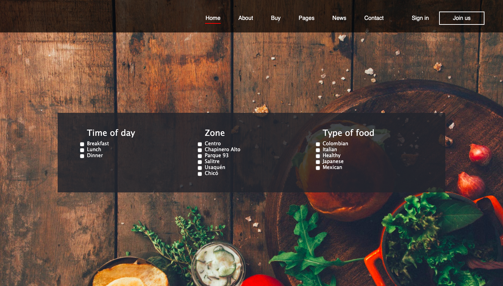

# RestaurantSearch
RestaurantSearch is a web application meant to help people find restaurants according to location, preferences and prices, among others. We provide a list of restaurants and their details in order to help people find the one that fits best for them. 



This application has API REST to connect to a MongoDB obtaining restaurants and their details. 
## Authors
[Valentina Chacón Buitrago](https://github.com/ValentinaChaconBuitrago)

[Juan Diego Arango Ramos](https://github.com/juandarango98)
## Objectives
* Develop a dynamic web page that shows and updates a list of restaurants, allowing users to filter content based on different criteria such as location and prices.
* Implement both server side and client side rendering of content in the page.
* Create a tool that persists user's information.

## Technologies used
* HTML, CSS, Bootstrap, Javascript, Node.js, Express.js, MongoDB, Mongo Atlas

## Application deployment
This application has both a front and back end, and it is necessary to have a certain setup in order to use it. 
### Requirements
#### Node.js
If you don't have Node.js installed, you can download it [here](https://nodejs.org/en/).
#### MongoDB 
If you're storing your data locally, install Mongo following the instructions [here](https://www.mongodb.com/en).
Once you have installed Mongo, run the following command in your terminal:

```
mongod
mongo
```
In case you are using Mongo Atlas and your data is stored in the cloud, whitelist your IP address and create a new data base user. More details on how to configure this set up [here](https://docs.atlas.mongodb.com/driver-connection/).

### Yarn for MAC
This project was developed using MAC's iOS, if using this same OS install yarn using the following command:
```
brew install yarn
```

Because this project was implemented using Mongo Atlas, the database is already available so, to run the application, just use the following command:
```
yarn start
```
After this, the application will be available at http://localhost:3000/

## Deployed Application
[Restaurants](https://bogota-restaurants.herokuapp.com/)

## License
[MIT License](https://github.com/ValentinaChaconBuitrago/Search_Restaurants/blob/master/LICENSE)


